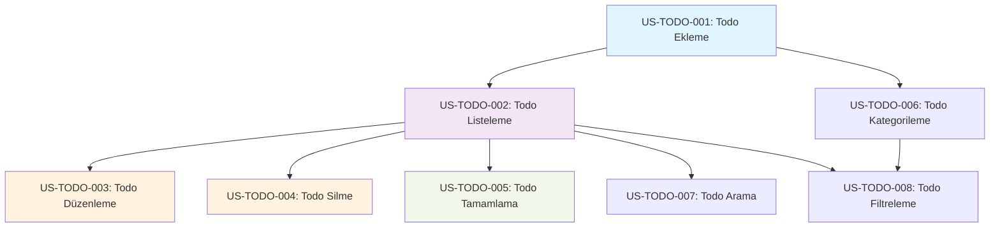

# Dependency Mapping Komutu

Bu komut Business Analyst Agent tarafından user story'ler arasındaki dependencies'leri belirlemek ve optimal implementation order oluşturmak için kullanılır.

## Kullanım
```
/dependency-map [stories-directory] [epic-scope] [priority-weights]
```

## Örnek Kullanım
```
/dependency-map "stories/todo-management/" "mvp-scope" "business-value:3,risk:2,effort:1"
```

## Dependency Analysis Types

### 1. Technical Dependencies
- **Data Model Dependencies**: Entity relationships
- **Component Dependencies**: Shared UI components
- **Service Dependencies**: API endpoint requirements
- **Infrastructure Dependencies**: Database, authentication

### 2. Business Dependencies
- **User Journey Dependencies**: Logical user flow
- **Feature Dependencies**: Feature prerequisite requirements
- **Validation Dependencies**: Business rule validations

### 3. Integration Dependencies
- **External System Dependencies**: Third-party integrations
- **Internal Service Dependencies**: Microservice communications

## Dependency Mapping Process

### Step 1: Story Dependency Analysis
```markdown
# Dependency Analysis: Todo Management Epic

## Story Inventory
1. **US-TODO-001**: Todo Ekleme
2. **US-TODO-002**: Todo Listeleme
3. **US-TODO-003**: Todo Düzenleme  
4. **US-TODO-004**: Todo Silme
5. **US-TODO-005**: Todo Tamamlama
6. **US-TODO-006**: Todo Kategorileme
7. **US-TODO-007**: Todo Arama
8. **US-TODO-008**: Todo Filtreleme

## Technical Dependencies Matrix

| Story | Depends On | Type | Criticality |
|-------|------------|------|-------------|
| US-TODO-001 | - | - | Foundation |
| US-TODO-002 | US-TODO-001 | Data | Critical |
| US-TODO-003 | US-TODO-001, US-TODO-002 | UI/Data | High |
| US-TODO-004 | US-TODO-002 | UI | Medium |
| US-TODO-005 | US-TODO-002 | Business Logic | High |
| US-TODO-006 | US-TODO-001, US-TODO-002 | Data Model | Medium |
| US-TODO-007 | US-TODO-002 | Feature | Low |
| US-TODO-008 | US-TODO-002, US-TODO-006 | Feature | Low |
```

### Step 2: Dependency Graph


### Step 3: Critical Path Analysis
```markdown
## Critical Path Identification

### Path 1 (Foundation): 
US-TODO-001 → US-TODO-002 → US-TODO-005
- **Duration**: 8 points (3+3+2)
- **Business Value**: High (Core functionality)
- **Risk**: Low (Well-understood requirements)

### Path 2 (Management):
US-TODO-001 → US-TODO-002 → US-TODO-003 → US-TODO-004
- **Duration**: 10 points (3+3+2+2)
- **Business Value**: Medium (CRUD completion)
- **Risk**: Medium (UI complexity)

### Path 3 (Organization):
US-TODO-001 → US-TODO-006 → US-TODO-008
- **Duration**: 8 points (3+3+2)
- **Business Value**: Medium (Advanced features)
- **Risk**: High (Complex filtering logic)

**Critical Path**: Path 2 (10 points) - Longest duration
```

## Implementation Strategy

### Strategy 1: Sequential Implementation
```markdown
## Sequential Sprint Planning

### Sprint 1 (Foundation)
**Goal**: Basic todo operations
**Stories**: 
- US-TODO-001: Todo Ekleme (3 points)
- US-TODO-002: Todo Listeleme (3 points)
- US-TODO-005: Todo Tamamlama (2 points)
**Total**: 8 points

**Deliverables**: 
- ✅ Users can add todos
- ✅ Users can view todo list
- ✅ Users can mark todos complete
- ✅ Basic todo functionality working

### Sprint 2 (Management)
**Goal**: Full CRUD operations  
**Stories**:
- US-TODO-003: Todo Düzenleme (2 points)
- US-TODO-004: Todo Silme (2 points)
- US-TODO-006: Todo Kategorileme (3 points)
**Total**: 7 points

**Deliverables**:
- ✅ Complete todo management
- ✅ Category system
- ✅ Enhanced user experience

### Sprint 3 (Enhancement)
**Goal**: Advanced features
**Stories**:
- US-TODO-007: Todo Arama (3 points)
- US-TODO-008: Todo Filtreleme (2 points)
**Total**: 5 points

**Deliverables**:
- ✅ Search functionality
- ✅ Advanced filtering
- ✅ Full-featured todo app
```

### Strategy 2: Parallel Development
```markdown
## Parallel Sprint Planning

### Sprint 1 (Parallel Tracks)
**Track A (Core)**: US-TODO-001, US-TODO-002 (6 points)
**Track B (Infrastructure)**: Authentication, Database setup (6 points)

### Sprint 2 (Feature Development)  
**Track A (CRUD)**: US-TODO-003, US-TODO-004, US-TODO-005 (6 points)
**Track B (Categories)**: US-TODO-006, Category UI (5 points)

### Sprint 3 (Advanced Features)
**Combined**: US-TODO-007, US-TODO-008, Polish (7 points)
```

## Risk Assessment & Mitigation

### High-Risk Dependencies
```markdown
## Risk Analysis

### Risk 1: Authentication System Delay
**Affected Stories**: All stories (authentication required)
**Impact**: Complete project delay
**Probability**: Medium
**Mitigation**: 
- Start authentication implementation early
- Create mock authentication for development
- Parallel development strategy

### Risk 2: Data Model Changes
**Affected Stories**: US-TODO-006, US-TODO-008
**Impact**: Rework in filtering and categorization
**Probability**: Low
**Mitigation**:
- Finalize data model early
- Flexible data structure design
- Database migration strategy

### Risk 3: UI Component Dependencies
**Affected Stories**: US-TODO-003, US-TODO-007, US-TODO-008
**Impact**: UI consistency issues
**Probability**: Medium
**Mitigation**:
- Component library setup first
- Design system establishment
- Shared component development
```

### Dependency Conflict Resolution
```markdown
## Conflict Resolution Strategies

### Scenario 1: Circular Dependencies
**Problem**: Story A needs B, Story B needs A
**Resolution**: 
1. Break circular dependency by interface design
2. Create intermediate abstraction layer
3. Implement in phases with progressive enhancement

### Scenario 2: Resource Conflicts
**Problem**: Multiple stories need same developer
**Resolution**:
1. Prioritize by business value
2. Look for parallelizable work
3. Cross-train team members

### Scenario 3: External Dependencies
**Problem**: Third-party service not ready
**Resolution**:
1. Create mock/stub implementation
2. Interface-based development
3. Parallel track with integration later
```

## Output Deliverables

### 1. Implementation Roadmap
```markdown
# Todo Management Implementation Roadmap

## Week 1-2: Foundation Phase
- Authentication setup
- Basic todo CRUD (US-TODO-001, US-TODO-002)
- Core UI components

## Week 3-4: Management Phase  
- Todo operations (US-TODO-003, US-TODO-004, US-TODO-005)
- Category system (US-TODO-006)

## Week 5-6: Enhancement Phase
- Search & filter (US-TODO-007, US-TODO-008)
- Performance optimization
- Polish & testing
```

### 2. Dependency Matrix
- Visual dependency mapping
- Critical path highlighting
- Risk assessment overlay
- Sprint boundary mapping

### 3. Implementation Order
```markdown
## Recommended Implementation Order

**Priority 1 (Must Have)**:
1. US-TODO-001: Todo Ekleme
2. US-TODO-002: Todo Listeleme  
3. US-TODO-005: Todo Tamamlama

**Priority 2 (Should Have)**:
4. US-TODO-003: Todo Düzenleme
5. US-TODO-004: Todo Silme
6. US-TODO-006: Todo Kategorileme

**Priority 3 (Could Have)**:
7. US-TODO-007: Todo Arama
8. US-TODO-008: Todo Filtreleme
```

## Sonraki Adımlar
Dependency map onaylandıktan sonra stories implementation için Developer Agent'a geçer.