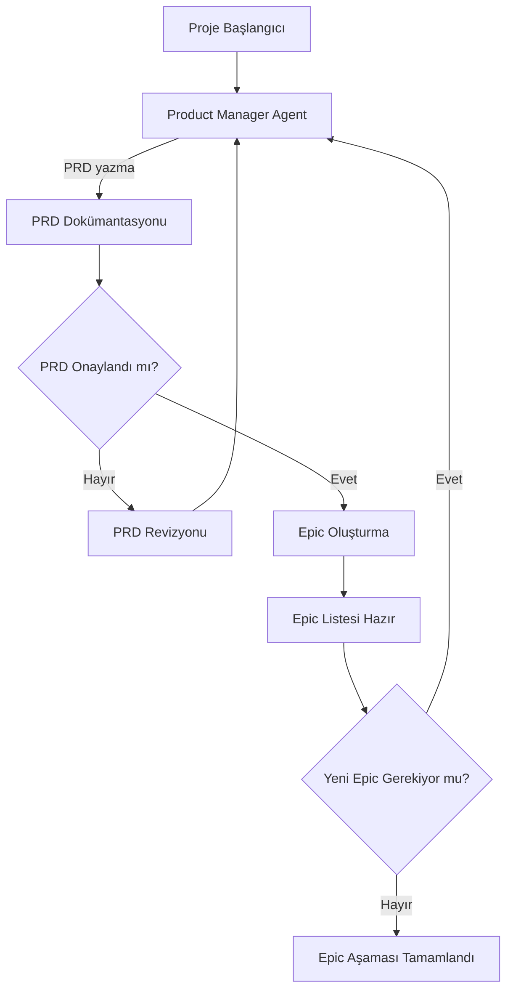
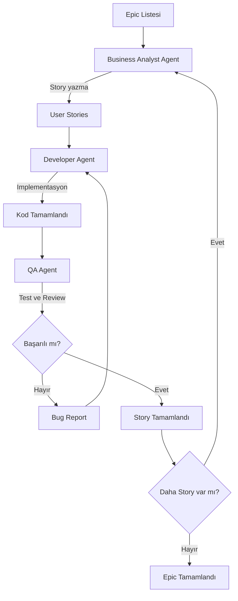

# AI Agent Takımı Workflow ve Yetkileri

## Agent Görev Sınırları ve Yetkileri

### 1. Product Manager Agent
**Yetkiler:**
- PRD yazma/güncelleme ✅
- Epic oluşturma/değiştirme ✅
- Roadmap belirleme ✅
- Stakeholder iletişimi ✅

**Yasak Alanlar:**
- Story detayları yazma ❌
- Kod inceleme ❌
- Teknik kararlar ❌

### 2. Business Analyst Agent
**Yetkiler:**
- Epic'i story'lere böler ✅
- User story yazma ✅
- Acceptance criteria ✅
- Requirement analizi ✅

**Yasak Alanlar:**
- Epic değiştirme ❌
- PRD güncelleme ❌
- Kod/teknik konular ❌

### 3. Developer Agent
**Yetkiler:**
- Kod yazma/değiştirme ✅
- Unit test yazma ✅
- Teknik mimari kararları ✅
- Story'yi task'lara böler ✅
- Bug fixing ✅

**Yasak Alanlar:**
- Story yazma/değiştirme ❌
- PRD okuma ❌
- Epic erişimi ❌

### 4. QA Agent
**Yetkiler:**
- Code review ✅
- Test case yazma ✅
- Bug reporting ✅
- Technical debt yönetimi ✅
- Release validation ✅

**Yasak Alanlar:**
- Kod değiştirme ❌
- Story yazma ❌
- Epic/PRD değiştirme ❌

## Workflow 1: PRD ve Epic Belirleme



**Workflow 1 Sorumluları:**
- **Product Manager Agent**: PRD yazma, Epic oluşturma, roadmap belirleme

---

## Workflow 2: Story Implementasyonu ve Kontrol



**Workflow 2 Sorumluları:**
- **Business Analyst Agent**: Epic → Story dönüşümü
- **Developer Agent**: Story implementasyonu  
- **QA Agent**: Test, review, bug reporting

---

## Basit Yetki Matrisi

| Agent | Workflow 1 | Workflow 2 |
|-------|------------|------------|
| **PM** | PRD, Epic ✅ | ❌ |
| **BA** | ❌ | Story yazma ✅ |
| **Dev** | ❌ | Kod yazma ✅ |
| **QA** | ❌ | Test, review ✅ |

---

## Workflow Geçişleri

1. **Workflow 1** tamamlandığında → **Epic Listesi** çıktısı
2. **Epic Listesi** → **Workflow 2** girdisi
3. **Workflow 2** her epic için tekrarlanır

---

## 🛠️ Agent Custom Commands Özeti

### Product Manager Agent Commands
- **`/create-prd`** - Kapsamlı PRD oluşturur
- **`/generate-epics`** - PRD'den epic'leri çıkarır
- **`/roadmap-plan`** - Detaylı roadmap oluşturur
- **`/stakeholder-report`** - Progress raporları hazırlar

### Business Analyst Agent Commands  
- **`/epic-to-stories`** - Epic'i user story'lere böler
- **`/story-refine`** - Story'leri geliştir ve detaylandır
- **`/story-estimate`** - Story point estimation yapar
- **`/dependency-map`** - Story dependencies belirler

### Developer Agent Commands
- **`/story-implement`** - Story'yi tam implementation
- **`/code-scaffold`** - Boilerplate kod oluşturur
- **`/test-suite-generate`** - Kapsamlı test suite
- **`/bug-fix-implement`** - Bug fix implementation

### QA Agent Commands
- **`/code-review-full`** - Comprehensive code review
- **`/test-cases-generate`** - Test case suite oluşturur
- **`/bug-report-create`** - Structured bug reports
- **`/release-validate`** - Release readiness validation
- **`/performance-audit`** - Performance & accessibility audit

---

## 🔄 Command-Enhanced Workflow

### Enhanced Workflow 1: PRD ve Epic Belirleme
```mermaid
flowchart TD
    A[Proje Başlangıcı] --> B[Product Manager Agent]
    B -->|/create-prd| C[PRD Dokümantasyonu]
    C --> D{PRD Onaylandı mı?}
    D -->|Hayır| E[/stakeholder-report ile revizyon]
    E --> B
    D -->|Evet| F[/generate-epics komutu]
    F --> G[/roadmap-plan komutu]
    G --> H[Epic Listesi + Roadmap Hazır]
```

### Enhanced Workflow 2: Story Implementasyonu ve Kontrol
```mermaid
flowchart TD
    A[Epic Listesi] --> B[Business Analyst Agent]
    B -->|/epic-to-stories| C[/story-estimate]
    C --> D[/dependency-map]
    D --> E[User Stories + Implementation Order]
    E --> F[Developer Agent]
    F -->|/code-scaffold| G[/story-implement]
    G --> H[/test-suite-generate]
    H --> I[QA Agent]
    I -->|/code-review-full| J[/test-cases-generate]
    J --> K{Quality OK?}
    K -->|Hayır| L[/bug-report-create]
    L --> F
    K -->|Evet| M[/release-validate]
    M --> N[Story Tamamlandı]
```

---

## 📊 Agent Authority Matrix (Updated)

| Görev Alanı | PM | BA | Dev | QA | Custom Commands |
|-------------|----|----|-----|----|-----------------| 
| **PRD Management** | ✅ Full | ❌ | ❌ | ❌ | `/create-prd` |
| **Epic Management** | ✅ Full | ❌ | ❌ | ❌ | `/generate-epics`, `/roadmap-plan` |
| **Story Creation** | ❌ | ✅ Full | ❌ | ❌ | `/epic-to-stories`, `/story-refine` |
| **Story Estimation** | ❌ | ✅ Full | ❌ | ❌ | `/story-estimate` |
| **Dependency Planning** | ❌ | ✅ Full | ❌ | ❌ | `/dependency-map` |
| **Code Implementation** | ❌ | ❌ | ✅ Full | ❌ | `/story-implement`, `/code-scaffold` |
| **Test Development** | ❌ | ❌ | ✅ Full | ❌ | `/test-suite-generate` |
| **Bug Fixing** | ❌ | ❌ | ✅ Full | ❌ | `/bug-fix-implement` |
| **Code Review** | ❌ | ❌ | ❌ | ✅ Full | `/code-review-full` |
| **Quality Assurance** | ❌ | ❌ | ❌ | ✅ Full | `/test-cases-generate`, `/performance-audit` |
| **Bug Reporting** | ❌ | ❌ | ❌ | ✅ Full | `/bug-report-create` |
| **Release Decision** | ❌ | ❌ | ❌ | ✅ Full | `/release-validate` |
| **Progress Reporting** | ✅ Full | ❌ | ❌ | ❌ | `/stakeholder-report` |

---

## 🚀 Command Integration Benefits

### Efficiency Gains
- **Automated Documentation**: Commands generate consistent, structured outputs
- **Quality Standardization**: Built-in quality checks and validations
- **Workflow Automation**: Commands can chain together for complex tasks
- **Template Consistency**: Standardized formats across all deliverables

### Quality Improvements  
- **INVEST Validation**: BA commands ensure story quality
- **Code Standards**: Developer commands enforce best practices
- **Comprehensive Testing**: QA commands ensure thorough validation
- **Performance Monitoring**: Built-in performance and accessibility checks

### Team Coordination
- **Clear Handoffs**: Structured output formats for agent transitions
- **Dependency Management**: Automatic dependency tracking and resolution
- **Progress Visibility**: Real-time progress tracking through commands
- **Risk Management**: Early identification and mitigation of project risks

Bu command-enhanced workflow ile todo app projesi için end-to-end otomasyona sahip, yüksek kaliteli ve koordineli bir geliştirme süreci elde ediyoruz.