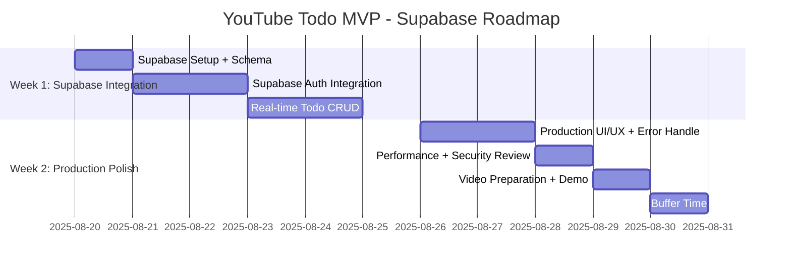

# Roadmap - YouTube Todo MVP

**Project Timeline:** 1-2 weeks maksimum  
**Team Size:** 1 developer (YouTube tutorial format)  
**Epic Count:** 1 epic sadece  
**Roadmap Version:** 2.0 (Simplified)  
**Last Updated:** 2025-08-20

---

## Project Overview

YouTube tutorial için **modern, production-ready todo uygulaması** roadmap'i. Supabase ile real-world development odaklı.

### Core Principle: MODERN & PROFESSIONAL
- ✅ **Tek Epic:** YouTube Todo MVP (Supabase-powered)
- ✅ **5 Story Maksimum** (Real-time features)
- ✅ **1-2 Hafta Timeline**
- ✅ **Industry Standard Stack**
- ✅ **Real-time Sync Demo-ready**

---

## Timeline Visualization

---

## Week-by-Week Breakdown

### Week 1: Supabase Integration
**Goal:** "Production-ready todo app with real-time features"

#### Day 1: Supabase Setup (Story 1 - Part 1)
- **Deliverables:**
  - Supabase project creation
  - Database schema + RLS policies
  - Frontend project setup (Vite + React + TS)
  - Environment configuration

- **Success Criteria:**
  - Supabase project operational
  - Database tables created
  - Frontend project connected

#### Day 2-3: Supabase Auth Integration (Story 1 - Part 2)
- **Deliverables:**
  - AuthForm component (login/register)
  - Supabase Auth hooks
  - Protected routes
  - Session management

- **Success Criteria:**
  - User can register via Supabase
  - User can login/logout
  - Auth state persists across sessions
  - Protected routes work

#### Day 4: Real-time Todo Creation (Story 2)
- **Deliverables:**
  - TodoForm component
  - Supabase database integration
  - Real-time subscriptions setup
  - Optimistic UI updates

- **Success Criteria:**
  - User can add todos to Supabase DB
  - Real-time sync across browser tabs
  - Input validation works
  - Loading states implemented

#### Day 5: Complete & Delete Todos (Stories 3 & 4)
- **Deliverables:**
  - Checkbox with real-time completion
  - Delete button with instant sync
  - Error handling & rollback
  - Visual feedback for all operations

- **Success Criteria:**
  - User can mark todos complete (real-time)
  - User can delete todos (instant sync)
  - Changes sync across all devices
  - Error states handled gracefully

### Week 2: Production Polish

#### Day 6-7: Production UI/UX (Story 5)
- **Deliverables:**
  - Mobile responsive design
  - Desktop layout optimization
  - Loading states for all operations
  - Error boundaries & user-friendly messages
  - Offline indicator
  - Touch-friendly buttons

- **Success Criteria:**
  - Works on mobile (375px+)
  - Works on desktop (1024px+)
  - Matches reference design exactly
  - Professional loading & error states
  - All interactions mobile-friendly

#### Day 8: Performance & Security Review
- **Deliverables:**
  - Performance optimization
  - Security audit (RLS policies)
  - TypeScript strict mode enforcement
  - Bundle size optimization
  - Error handling improvements

- **Success Criteria:**
  - Load time < 2 seconds
  - Zero TypeScript errors
  - RLS policies tested & secure
  - Optimistic updates working smoothly

#### Day 9: Video Preparation & Demo
- **Deliverables:**
  - Final testing across devices
  - Real-time sync demo preparation
  - Screen recording setup
  - Multi-browser demo script
  - Code documentation

- **Success Criteria:**
  - App ready for professional demo
  - Real-time features showcase-ready
  - No bugs in core features
  - Video content planned

#### Day 10: Buffer/Contingency
- **Purpose:** Extra time for:
  - Unexpected technical issues
  - Additional polish
  - Video recording & editing
  - Last-minute improvements
  - Deployment setup

---

## Resource Allocation

### Single Developer Focus

#### Week 1 Allocation
- **40% Time:** Supabase Setup & Auth (Story 1)
- **40% Time:** Real-time Todo CRUD (Stories 2,3,4)
- **20% Time:** Infrastructure & Testing

#### Week 2 Allocation
- **50% Time:** Production UI/UX (Story 5)
- **30% Time:** Performance & Security
- **20% Time:** Documentation & Video Prep

### Technology Stack (Modern & Production-Ready)
- **Backend:** Supabase (Auth + Database + Real-time)
- **Frontend:** Vite + React 18 + TypeScript (Recommended)
- **Database:** PostgreSQL with Row Level Security
- **Styling:** Tailwind CSS + Lucide Icons
- **Real-time:** Supabase subscriptions
- **Build:** Vite (HMR + fast builds)

---

## Success Milestones

### End of Week 1: Real-time MVP
**Criteria:**
- [ ] Supabase Auth integration complete
- [ ] Real-time Todo CRUD operational
- [ ] Cross-browser sync working
- [ ] Database RLS policies configured
- [ ] Basic error handling implemented

**Demo Ready:** Real-time features working

### End of Week 2: Production Ready
**Criteria:**
- [ ] Professional UI/UX complete
- [ ] Performance optimized (<2s load)
- [ ] Security audited & secure
- [ ] Code clean and documented
- [ ] Multi-device tested
- [ ] Video-ready state

**Demo Ready:** Professional app showcase with real-time sync

---

## Risk Management (Simplified)

### Low Risk Items ✅
- React/TypeScript basics
- Supabase client integration (well-documented)
- Tailwind CSS styling
- Vite build setup

### Medium Risk Items ⚠️
- Real-time subscriptions setup
- Supabase RLS configuration
- Cross-device testing
- Time management

### High Risk Items ⚠️⚠️
- Database schema mistakes
- Security configuration errors
- Real-time performance issues

### Risk Mitigation
1. **Use Supabase Templates:** Start with official examples
2. **Test Real-time Early:** Verify sync across tabs immediately
3. **Keep RLS Simple:** Basic user isolation policies
4. **Have Fallback Plan:** Regular CRUD if real-time fails
5. **Security First:** Audit RLS policies before video
6. **Time Boxing:** Stick to daily goals strictly

---

## Quality Standards

### Code Quality
- **TypeScript:** Strict mode enabled + generated types
- **ESLint:** React + TypeScript rules
- **Prettier:** Consistent code formatting
- **Clean Code:** Production-ready patterns

### Performance
- **Load Time:** <2 seconds (optimized)
- **Interactions:** <100ms response + optimistic updates
- **Bundle Size:** Minimal (tree-shaking)
- **Real-time:** Efficient subscriptions only

### Security
- **Supabase RLS:** Row Level Security policies
- **Environment:** Secure key management
- **Auth:** Session-based authentication
- **Validation:** Client + server validation

### Educational Value
- **Modern Patterns:** Industry-standard code
- **Real-world Skills:** Production technologies
- **Comments:** Explain Supabase integration
- **Documentation:** Comprehensive setup guide

---

## Scope Protection

### ✅ MUST HAVE (Non-negotiable)
- Supabase Auth integration (register/login/logout)
- Real-time todo CRUD operations
- Cross-device data synchronization
- Production-ready error handling
- Professional responsive design
- Database security (RLS policies)

### ⚠️ NICE TO HAVE (If time allows)
- Advanced loading animations
- Offline support enhancements
- Email verification
- Performance monitoring
- Additional error boundaries

### ❌ OUT OF SCOPE (Do NOT add)
- Categories/tags/projects
- Advanced search/filter
- Due dates & reminders
- Dark/light theme toggle
- Team collaboration
- Complex animations/transitions
- File attachments
- User profiles/settings
- Password reset flow
- Analytics/reporting

---

## Communication Plan

### Daily Progress
- **Morning:** Plan day's tasks
- **Evening:** Review completed work
- **Document:** Progress in comments

### Weekly Reviews
- **End Week 1:** Core functionality demo
- **End Week 2:** Final app showcase

### Video Content Plan (Supabase Focus)
- **Intro:** Modern stack overview + real-time demo
- **Supabase Setup:** Project creation + database schema
- **Auth Integration:** Professional authentication flow
- **Real-time Features:** Live sync demonstration
- **Production Polish:** Error handling + performance
- **Final Demo:** Multi-browser sync showcase

---

## Success Criteria

### Functional Requirements
- [ ] User can register/login via Supabase Auth
- [ ] User can add todos (real-time sync)
- [ ] User can mark todos complete (instant update)
- [ ] User can delete todos (cross-device sync)
- [ ] App works on mobile and desktop
- [ ] Real-time sync across all devices/tabs
- [ ] Data persists with enterprise security

### Technical Requirements
- [ ] TypeScript strict mode (zero errors)
- [ ] Production-ready code patterns
- [ ] Comprehensive error handling & loading states
- [ ] Professional responsive design
- [ ] Supabase RLS policies configured
- [ ] Performance optimized (<2s load time)

### Educational Requirements
- [ ] Modern industry-standard patterns
- [ ] Real-world production skills
- [ ] Complete in promised timeframe
- [ ] Professional YouTube content ready
- [ ] Demonstrates valuable technologies

---

## Post-Launch

### Video Publishing
- **Content:** Modern stack development + real-time demo
- **Length:** 45-50 minutes target
- **Format:** Professional screen recording + explanation
- **Repository:** GitHub with comprehensive setup guide
- **Highlight:** Real-time sync across multiple browsers

### Potential Follow-ups
- **Part 2:** Advanced Supabase features (storage, edge functions)
- **Part 3:** Team collaboration with real-time presence
- **Part 4:** Production deployment (Vercel + Supabase)
- **Part 5:** Mobile app with React Native + Supabase

---

**Roadmap Status:** ✅ APPROVED - Ready for Supabase Development  
**Next Step:** Begin Story 1 (Supabase Setup + Auth Integration)  
**Owner:** Product Manager Agent  
**Timeline:** 1-2 weeks maximum  
**Tech Stack:** Supabase + Vite + React + TypeScript (Modern & Production-Ready)